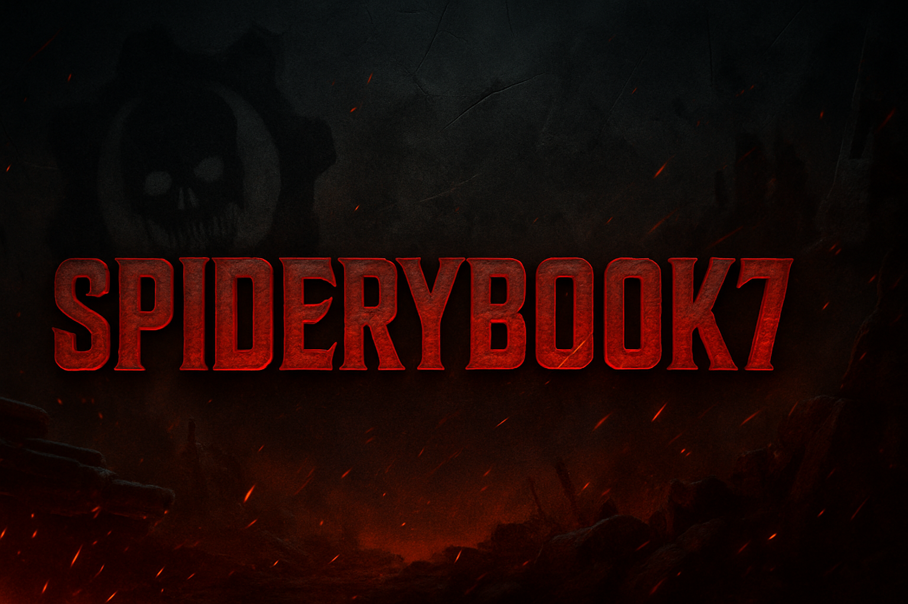

<!-- Banner estilo Gears of War -->

  

<h1 align="center">🛡️ SpideryBook7 | Command Center Online</h1>

  <i>"In this code war... silence is fatal. I code. I conquer. I evolve."</i> 
  <strong>Full-Stack Developer ⚙️ | Creative Strategist 🧠 | Gamer by Blood 🎮</strong>

---

## 🧠 Tactical Intel

Welcome, soldier. I'm **SpideryBook7**, a developer forged in digital trenches.

> 💥 Fueled by the spirit of Gears of War.  
> 🧩 I design systems that hit hard, load fast, and feel legendary.  
> ⚙️ I write code like battle plans: clean, structured, and efficient.  
> 🧠 Always adapting. Always improving. Always hunting the next upgrade.

---

## 🧰 Tech Arsenal

Tools I deploy with precision:

---

## 🎯 Battle Stats

  

---

## 🎖️ Missions & Deployments

🧱 **Warbase Manager**  
> 💼 Tactical warehouse system with precision UI  
> `MongoDB | React | TailwindCSS | Node.js`

🌌 **Historias Eternas**  
> 📚 Heartfelt storytelling platform  
> `React Native | Firebase | Express.js`

🚗 **CSR Reborn** *(In progress)*  
> 🏁 Mobile racing project inspired by CSR legacy  
> `Unity | C# | Mobile`

---

## ⚔️ Combat Ready Traits

- 🧠 Creative strategist with pixel-perfect vision  
- 🧪 Explorer of unknown APIs and frameworks  
- 🔧 Tailor of efficient UI/UX workflows  
- 👾 Hardcore gamer turned developer-architect

---

## 📡 Connect With Command

  
  
  

---

  
  

<i>“Victory is not given. It's coded.”</i>

